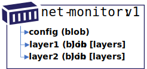

# OCI Artifact Manifest

The OCI artifact manifest generalizes the use of [OCI image manifest][oci-image-manifest-spec]. It provides a means to define a wide range of artifacts, including a chain of related artifacts enabling SBoMs, Signatures and metadata. The decision to use `oci.artifact.manifest`, [oci.image.manifest][oci-image-manifest-spec] or [oci.image.index][oci-image-index] is up to the authors of specific artifact types.

For spec details, see [artifact-manifest-spec.md](./artifact-manifest-spec.md)

## Canonical Artifact Types

OCI artifact manifest is intended to support the following types of artifacts:

- [Individual Artifacts](#individual-artifacts)
- [Artifact Enhancements](#artifact-enhancements)

## Example OCI Artifact Manifests

- [`net-monitor:v1` container image](./artifact-manifest/net-monitor-image.json)
- [`net-monitor:v1` notary v2 signature](./artifact-manifest/net-monitor-image-signature.json)
- [`net-monitor:v1` sbom](./artifact-manifest/net-monitor-image-sbom.json)
- [`net-monitor:v1` nydus image](./artifact-manifest/net-monitor-nydus-image.json)

### Individual Artifacts

Individual artifacts include Helm, Singularity, WASM and other artifacts that currently use OCI Artifact v1 definitions. The main differentiation to types currently supported with oci.manifest is the ability to decouple the config from the artifact type definition. All scenarios covered with the initial OCI Artifact definition may be migrated to the OCI artifact manifest with the additional capabilities of referencing existing `manifests`.

### Artifact Enhancements

There are a new set of scenarios requiring the ability to reference existing artifacts, including the ability to additively sign content or add an SBoM. The addition of a [`[manifests]`][manifests] property supports linking independent artifacts. By storing these as separate, but linked artifacts, the existing OCI Image tool chain remains unchanged. Tooling that opts into understanding SBoM or Notary v2 signatures can find the linked artifacts without changing the existing image tool chains.

### Example Image

The net-monitor image contains a config and a collection of layers, as defined by the [oci-image-spec][oci-image-manifest-spec].



The `net-monitor:v1` image has a representative `oci.image.manifest`, with a specific digest:

**digest:** `net-monitor@sha256:73c803930ea3ba1e54bc25c2bdc53edd0284c62ed651fe7b00369da519a3c333`
```json
{
  "schemaVersion": 2,
  "config": {
    "mediaType": "application/vnd.oci.image.config.v1+json",
    "size": 7097,
    "digest": "sha256:e752324f6804d5d0b2c098f84507d095a8fd0031cf06cdb3c7ad1625dcd1b399"
  },
  "layers": [
    {
      "mediaType": "application/vnd.oci.image.layer.v1.tar+gzip",
      "size": 25851449,
      "digest": "sha256:83c5cfdaa5385ea6fc4d31e724fd4dc5d74de847a7bdd968555b8f2c558dac0e"
    },
    {
      "mediaType": "application/vnd.oci.image.layer.v1.tar+gzip",
      "size": 226,
      "digest": "sha256:7445693bd43e8246a8c166233392b33143f7f5e396c480f74538e5738fb6bd6e"
    }
  ]
}
```

### Notary v2 Signatures and SBoM Persistance

To support enhancements of existing artifacts, a new OCI artifact manifest provides for a collection of manifest references. Examples include Notary and SBoM artifacts.

A Notary v2 signature, or an SBoM, would be represented as a manifest with a config object and a signature, persisted as blobs. The `[manifests]` collection references the net-monitor image through a descriptor, which represents another manifest.


**A Notary v2 signature of the `net-monitor:v1` image:**

**digest:** `net-monitor@sha256:8ac803930ea3ba1e54bc25c2bdc53edd0284c62ed651fe7b00369da519a3c222`

```json
{
  "schemaVersion": 1,
  "mediaType": "application/vnd.oci.artifact.manifest.v1+json",
  "artifactType": "application/vnd.cncf.notary.v2"
  },
  "blobs": [
    {
      "mediaType": "application/tar",
      "digest": "sha256:9834876dcfb05cb167a5c24953eba58c4ac89b1adf57f28f2f9d09af107ee8f0",
      "size": 32654
    }
  ],
  "manifests": [
    {
      "mediaType": "application/vnd.oci.image.manifest.v1+json",
      "digest": "sha256:73c803930ea3ba1e54bc25c2bdc53edd0284c62ed651fe7b00369da519a3c333",
      "size": 4501
    }
  ],
  "annotations": {
    "org.cncf.notary.v2.signature.subject": "docker.io"
  }
}
```

The same `net-monitor:v1` image may have an associated SBoM. The `[manifests]` collection references the `net-monitor:v1` image through a manifest descriptor.


**digest:** `net-monitor@sha256:7a781a3930ea3ba1e54bc25c2bdc53edd0284c62ed651fe7b00369da519a3c1a81`

```json
{
  "schemaVersion": 1,
  "mediaType": "application/vnd.oci.artifact.manifest.v1+json",
  "artifactType": "application/vnd.example.sbom.v1",
  "blobs": [
    {
      "mediaType": "application/tar",
      "digest": "sha256:9834876dcfb05cb167a5c24953eba58c4ac89b1adf57f28f2f9d09af107ee8f0",
      "size": 32654
    }
  ],
  "manifests": [
    {
      "mediaType": "application/vnd.oci.image.manifest.v1+json",
      "digest": "sha256:73c803930ea3ba1e54bc25c2bdc53edd0284c62ed651fe7b00369da519a3c333",
      "size": 4501
    }
  ]
}
```

Once all artifacts are submitted, the registry would represent a graph of the `net-monitor:v1` image, with signatures, an SBoM, along with a signature on the SBoM.


The Notary v2 signature and SBoM reference the `net-monitor:v1` image through the `[manifests]` collection. The `net-monitor:v1` image is represented as an oci-image, and requires no changes to its manifest to support the enhancements. The directionality of the `[manifests]` references enables links to existing content, without changing the existing content.

### Deletion and Ref Counting

The manifests reference are said to be hard references. Just as the layers of an OCI Image are deleted (*ref-counted -1*), the blobs of a signature are deleted (*ref-counted -1*) when the signature is deleted. Likewise, when the `net-monitor:v1` image is deleted, the signatures and SBoM would be deleted (*ref-counted -1*) as the signatures and SBoMs have no value without the artifact they are signing.

## Artifact Manifest Scenarios

The main scenarios include:

1. [Content Discovery](#content-discovery)
1. [Content Promotion Within and Across Registries](#content-promotion-within-and-across-registries)
1. [Lifetime management](#lifetime-management), including deletion of artifacts and their linked manifests.

### Content Discovery

Registries support a flat list of content within designated repositories. A container image, multi-arch container image, Helm Chart, CNAB, Singularity, WASM and other OCI Artifact types can be listed based on their `manifest.config.mediaType`


In the above example, all the artifacts are displayed without relation to each other. The layers of the `wordpress:5` image are also displayed as an example of data that is already hidden.


In the above example, the Notary v2 signature, an SBoM and collection of attributes are displayed as directly associated with their primary artifact. The enhancements can be collapsed as the OCI artifact manifest provides the information required to assign them to their referenced artifact.

See [`/references`][references-api] API for more information on listing referenced content.

## Content Promotion Within and Across Registries

Artifacts are promoted within and across different registries. They may be promoted from dev, through test, to production. They may continue movement to a distribution point or deployment. As artifacts are promoted, content related to that artifact must be capable of moving with the artifact. The OCI artifact manifest provides manifest references enabling discovery and promotion.

### Example of Content Movement Within and Across Registries

**Example**: Content promoted across repositories within the same registry:

```bash
registry.acme-rockets.io/
  dev\
    web-image:v1
    web-image:v2
    web-image:v3
    web-deploy:v1
    web-deploy:v2
    web-deploy:v3
  staging/
    web-image:v2
    web-image:v3
    web-deploy:v2
    web-deploy:v3
  prod/
    web-image:v2
    web-deploy:v2
```

**Example**: Content promoted across different registries:

```bash
dev-registry.acme-rockets.io/
  web-image:v1
  web-image:v2
  web-image:v3
  web-deploy:v1
  web-deploy:v2
  web-deploy:v3
```

is promoted to:

```bash
prod-registry.acme-rockets.io/
  web-image:v2
  web-deploy:v2
```

**Example**: Content published for public consumption:

```bash
products.wabbit-networks.io/
  net-monitor:v1
  net-monitor-logger:v1
  charts/net-monitor:v1
```

#### Copying an OCI Image


As a reference, copying an image from a public registry to a private registry would involve `docker pull`, `docker tag` and `docker push`

```bash
docker pull net-monitor:v1
docker tag net-monitor:v1 registry.acme-rockets.io/base-artifacts/net-monitor:v1
docker push registry.acme-rockets.io/base-artifacts/net-monitor:v1
```

The above commands account for the image manifest and the associated layers. Note the directionality of the manifest `-->` config and layers references. A manifest declares the config and layers that must be accounted for before a manifest may be considered valid within a registry.

### Copying an OCI Image with References


Notary v2 signatures and a Notary v2 signed SBoM have been added to the `net-monitor:v1` image. Note the directionality of the SBoM and Notary v2 signature references. The Notary v2 signature and SBoM `-->` reference the `net-monitor:v1` image. From a user experience perspective, copying an image from a public registry to a private registry should copy the signatures and SBoM alongside the artifact they've signed. The OCI artifact manifest provides the information needed for a registry to index references from either direction.

### OCI-Registry CLI

To copy the above image and the associated signatures, an `oci-reg` cli is used for illustrative purposes. The `oci-reg` cli is an example of tools that could be built by the community, as they would work within and across different OCI conformant registry implementations.

The following command would copy the `net-monitor:v1` image from docker hub to the acme-rockets registry. The CLI _could_ be run within the source or target cloud eliminating the download/upload network hops.

```bash
oci-reg copy \
  --source docker.io/wabbitnetworks/net-monitor \
  --target registry.acme-rockets.io/base-artifacts/net-monitor:v1
```

The `oci-reg copy` command would:

- assure the manifest and layer/blob digests remain the same
- copy any artifacts that are dependent on the source artifact-manifest, persisting them in the target registry. These _could_ include Notary v2 signatures, SBoMs, GPL source or other referenced artifacts.

As the `[manifests]` collection is an optional collection, it can also be used as an optional parameter for deep or shallow copying of content.

**Example**: Optional parameters to include|exclude reference types:

```bash
oci-reg copy \
  --source docker.io/library/net-monitor:v1 \
  --target registry.acme-rockets.io/base-artifacts/net-monitor:v1 \
  --copy-references disabled
```

As the referenced types are defined by the `manifest.artifactType`, copying specific content may be specified.

**Example**: Filter the types of enhancements:

```bash
oci-reg copy \
  --source docker.io/library/net-monitor:v1 \
  --target registry.acme-rockets.io/base-artifacts/net-monitor:v1 \
  --include-references application/vnd.notary.v2
```

### Lifetime Management

Using the OCI artifact manifest, OCI distribution-spec APIs can provide standard delete operations, including options for deleting referenced artifacts. The registry, nor the `oci-reg` cli would need to know about specific artifact implementations.

**Example**: Deleting images, with their Notary v2 and SBoM references:

```bash
oci-reg delete registry.acme-rockets.io/base-artifacts/net-monitor:v1
```

**Example**: Deleting artifact references:

```bash
oci-reg delete-references registry.acme-rockets.io/base-artifacts/net-monitor:v1
```

**Example**: Deleting specific artifact reference types:

```bash
oci-reg delete-references \
  --artifactType application/vnd.cncf.notary.v2 \
  registry.acme-rockets.io/base-artifacts/net-monitor:v1
```

**Example**: Deleting a specific artifact reference:

```bash
oci-reg delete registry.acme-rockets.io/base-artifacts/net-monitor@sha256:b5b2b2c507a0944348e0303114d8d93aaaa081732b86451d9bce1f432a537bc7
```

## Further reading

- [Spec details about the oci.artifact.manifest](./artifact-manifest-spec.md)
- [OCI Artifact Links API](./manifest-references-api.md) for more information on listing references

[oci-image-manifest-spec]:         https://github.com/opencontainers/image-spec/blob/master/manifest.md
[references-api]:                 ./manifest-references-api.md
