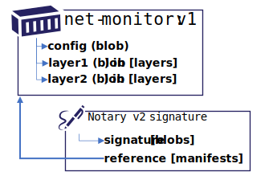
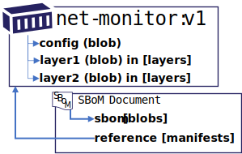

# OCI Artifact Manifest

The OCI artifact manifest improves upon the use of OCI image-manifest, using a unique `manifest.config.mediaType`. OCI artifact manifest provides a means to define a wide range of artifacts, including a chain of dependencies of related artifacts. It provides a means to define independent artifacts, however the primary scenario is to enhance other artifact types, including enhancing OCI image-manifest and OCI image-index.

## Canonical Artifact Types

OCI artifact manifest is intended to support the following types of artifacts:

- [Individual Artifacts](#individual-artifacts)
- [Artifact Enhancements](#artifact-enhancements)

### Individual Artifacts

An artifact may define a `config` object or share a `config` schema with other artifact types. The `oci.artifact.manifest` root `artifactType` property decouples the declaration of the type of artifact, from the type of config object used. All scenarios covered with the initial OCI Artifact definition may be migrated to the OCI artifact manifest with the additional capabilities of referencing existing `manifests`.

### Artifact Enhancements

An OCI Image is based on the oci-image-manifest, with a collection of manifests being represented as an OCI Index. The OCI Image manifest provides for an optional config object and a collection of layers, persisted as blobs. The Image manifest directly references the config and layer objects through OCI image-descriptors. The OCI image and index manifests are stored through content digests. The content digests are immutable, blocking any ability to add data to the objects at a later point.


**digest:** `wordpress@sha256:3c3a4604a545cdc127456d94e421cd355bca5b528f4a9c1905b15da2eb4a4c6b`
```json
{
  "schemaVersion": 2,
  "config": {
    "mediaType": "application/vnd.oci.image.config.v1+json",
    "size": 7097,
    "digest": "sha256:c8562eaf9d81c779cbfc318d6e01b8e6f86907f1d41233268a2ed83b2f34e748"
  },
  "layers": [
    {
      "mediaType": "application/vnd.oci.image.layer.v1.tar+gzip",
      "size": 27108069,
      "digest": "sha256:a076a628af6f7dcabc536bee373c0d9b48d9f0516788e64080c4e841746e6ce6"
    },
    {
      "mediaType": "application/vnd.oci.image.layer.v1.tar+gzip",
      "size": 1741,
      "digest": "sha256:f6c208f3f991dcbc417fed8efde391f887c0551d77ed0c1a125fd28f4841e1cc"
    }
  ]
}
```

To support enhancements of existing artifacts, a new OCI artifact manifest provides for a collection of manifest references. Examples include Notary and SBoM artifacts.

### Notary v2 Signatures and SBoM Persistance

A Notary v2 signature, or an SBoM, would be represented as a manifest with a config object and a signature, persisted as blobs.



**A Notary v2 signature of the `wordpress:5` image:**

```json
{
  "schemaVersion": 1,
  "mediaType": "application/vnd.oci.artifact.manifest.v1+json",
  "artifactType": "application/vnd.cncf.notary.v2+json",
  "config": {
    "mediaType": "application/vnd.cncf.notary.config.v2+json",
    "digest": "sha256:b5b2b2c507a0944348e0303114d8d93aaaa081732b86451d9bce1f432a537bc7",
    "size": 102
  },
  "blobs": [
    {
      "mediaType": "application/tar",
      "digest": "sha256:9834876dcfb05cb167a5c24953eba58c4ac89b1adf57f28f2f9d09af107ee8f0",
      "size": 32654
    }
  ],
  "manifests": [
    {
      "mediaType": "application/vnd.oci.image.manifest.v1+json",
      "digest": "sha256:3c3a4604a545cdc127456d94e421cd355bca5b528f4a9c1905b15da2eb4a4c6b",
      "size": 16724
    }
  ],
  "annotations": {
    "org.cncf.notary.v2.signature.subject": "docker.io"
  }
}
```



**An SBoM of the `wordpress:5` image:**

```json
{
  "schemaVersion": 1,
  "mediaType": "application/vnd.oci.artifact.manifest.v1+json",
  "artifactType": "application/vnd.example.sbom.v1+json",
  "config": {
    "mediaType": "application/vnd.example.sbom.config.v1+json",
    "digest": "sha256:b5b2b2c507a0944348e0303114d8d93aaaa081732b86451d9bce1f432a537bc7",
    "size": 102
  },
  "blobs": [
    {
      "mediaType": "application/tar",
      "digest": "sha256:9834876dcfb05cb167a5c24953eba58c4ac89b1adf57f28f2f9d09af107ee8f0",
      "size": 32654
    }
  ],
  "manifests": [
    {
      "mediaType": "application/vnd.oci.image.manifest.v1+json",
      "digest": "sha256:3c3a4604a545cdc127456d94e421cd355bca5b528f4a9c1905b15da2eb4a4c6b",
      "size": 16724
    }
  ],
  "annotations": {
    "example.sbom.author": "docker.io"
  }
}
```

Neither the signature, nor the SBoM, have value unto themselves. A signature and SBoM extend a given artifact. They're considered as dependent upon another artifact. The `manifests` collection references the `wordpress:5` digest, creating the dependency.


The Notary v2 signature and SBoM reference the `wordpress:5` image through the `manifests` collection. The `wordpress:5` image is represented as an oci-image, and requires no changes to its manifest to support the enhancements. The directionality of the references indicates the references in the `wordpress:5` image & the Notary v2 and SBoM manifest references to existing content.

Each OCI artifact manifest is independent, supporting multiple signatures, SBoMs and other artifacts to be added after the image was persisted. While an image knows of it's layers, and a Notary v2 signature knows of its config and blob, the image manifest does not know about the Notary v2 signature, nor the SBoM. The Notary v2 signature declares a dependency to the artifact it's signing. Upon upload completion, the registry would persist a reference between the `wordpress:5` image and the Notary v2 signature.

The manifests reference are said to be hard references. Just as the layers of an OCI Image are deleted (*ref-counted -1*), the blobs of a signature are deleted (*ref-counted -1*) when the signature is deleted. Likewise, when the `wordpress:5` image is deleted, the signatures and SBoM would be deleted (*ref-counted -1*) as the signatures and SBoMs have no value without the artifact they are signing.

## Artifact Manifest Scenarios

The main scenarios include:

1. [Content Discovery](#content-discovery)
1. [Content Promotion Within and Across Registries](#content-promotion-within-and-across-registries)
1. [Lifetime management](#lifetime-management), including deletion of artifacts and their linked references.

### Content Discovery

Registries support a flat list of content within designated repositories. A container image, multi-arch container image, Helm Chart, CNAB, Singularity, WASM and other OCI Artifact types can be listed based on their `manifest.config.mediaType`


In the above example, all the artifacts are displayed without relation to each other. The layers of the `wordpress:5` image are also displayed as an example of data that is already hidden.


In the above example, the Notary v2 signature, an SBoM and collection of attributes are displayed as directly associated with their primary artifact. The enhancements can be collapsed as the OCI artifact manifest provides the information required to assign them to their referenced artifact.

See [`Linked Artifacts API`](#linked-artifacts-api) for more information on listing referenced content.

### Content Promotion Within and Across Registries

Artifacts are promoted within a registry or across different registries. They may be promoted from dev, through test, to staging. They may continue movement to a distribution point or deployment. As artifacts are promoted, content related to that artifact SHOULD be capable of moving with the artifact. The OCI artifact manifest provides the references enabling discovery and promotion.

#### Example of Content Movement Within and Across Registries

**Example**: Content promoted across repositories within the same registry:

```bash
registry.acme-rockets.io/
  dev\
    web-image:v1
    web-image:v2
    web-image:v3
    web-deploy:v1
    web-deploy:v2
    web-deploy:v3
  staging/
    web-image:v2
    web-image:v3
    web-deploy:v2
    web-deploy:v3
  prod/
    web-image:v2
    web-deploy:v2
```

**Example**: Content promoted across different registries:

```bash
dev-registry.acme-rockets.io/
  web-image:v1
  web-image:v2
  web-image:v3
  web-deploy:v1
  web-deploy:v2
  web-deploy:v3
```

is promoted to:

```bash
prod-registry.acme-rockets.io/
  web-image:v2
  web-deploy:v2
```

**Example**: Content published for public consumption:

```bash
products.wabbit-networks.io/
  net-monitor:v1
  net-monitor-logger:v1
  charts/net-monitor:v1
```

#### Copying an OCI Image


As a reference, copying a container from a public registry to a private registry would involve `docker pull`, `docker tag` and `docker push`

```bash
docker pull wordpress:5
docker tag wordpress:5 registry.acme-rockets.io/base-artifacts/wordpress:5
docker push registry.acme-rockets.io/base-artifacts/wordpress:5
```

The above commands account for the image manifest and the associated layers. Note the directionality of the manifest `-->` config and layers references. A manifest declares the config and layers that must be accounted for before a manifest may be considered valid within a registry.

#### Copying an OCI Image with Enhancements


Notary v2 signatures and a Notary v2 signed SBoM have been added to the `wordpress:5` image. Note the directionality of the SBoM and Notary v2 signature references. The Notary v2 signature and SBoM `-->` reference the `wordpress:5` image. From a user experience perspective, copying a container from a public registry to a private registry should copy the signatures and SBoM alongside the artifact they've signed. The OCI artifact manifest provides the information needed for a registry to index references from either direction.

#### OCI-Registry CLI

To copy the above image and the associated signatures, a new `oci-reg` cli is used for illustrative purposes. The `oci-reg` cli is an example of tools that can be built by the community, as they would work within and across different OCI conformant registry implementations.

The following command would copy the `wordpress:5` image from docker hub to the acme-rockets registry. The CLI _could_ be run within the source or target cloud eliminating the download/upload network hops.

```bash
oci-reg copy \
  --source docker.io/library/wordpress:5 \
  --target registry.acme-rockets.io/base-artifacts/wordpress:5
```

The `oci-reg copy` command would:

- assure the manifest and layer/blob digests remain the same
- copy any artifacts that are dependent on the source artifact-manifest, persisting them in the target registry. These _could_ include Notary v2 signatures, SBoMs, GPL source or other referenced artifacts.

**Example**: Optional parameters to include|exclude reference types:

```bash
oci-reg copy \
  --source docker.io/library/wordpress:5 \
  --target registry.acme-rockets.io/base-artifacts/wordpress:5 \
  --copy-enhancements disabled
```

**Example**: Filter the types of enhancements:

```bash
oci-reg copy \
  --source docker.io/library/wordpress:5 \
  --target registry.acme-rockets.io/base-artifacts/wordpress:5 \
  --include-enhancements application/vnd.notary.v2.config.v1+json
```

### Lifetime Management

Using the OCI artifact manifest, OCI distribution-spec APIs can provide standard delete operations, including options for deleting referenced artifacts. The registry, nor the `oci-reg` cli would need to know about specific artifact implementations.

**Example**: Deleting images, with their Notary and SBoM enhancements:

```bash
oci-reg delete registry.acme-rockets.io/base-artifacts/wordpress:5
```

**Example**: Deleting artifact enhancements:

```bash
oci-reg link delete registry.acme-rockets.io/base-artifacts/wordpress:5
```

**Example**: Deleting specific artifact enhancement types:

```bash
oci-reg link delete \
  --artifactType application/vnd.cncf.notary.v2.config.v1+json \
  registry.acme-rockets.io/base-artifacts/wordpress:5
```

**Example**: List artifact links:

To delete a specific linked artifact, a `link list` query would be executed:

```bash
oci-reg link list registry.acme-rockets.io/base-artifacts/wordpress:5
```

The results would include the `artifactType` and digest. See [Links API](#links-api) for more details.

**Example**: Deleting a specific artifact enhancement:

```bash
oci-reg delete registry.acme-rockets.io/base-artifacts/wordpress@sha256:b5b2b2c507a0944348e0303114d8d93aaaa081732b86451d9bce1f432a537bc7
```

## OCI Artifact Manifest Properties

OCI Artifact Manifests provide the following types of references:

- **Blobs:** Content that represents the artifact. These are analogues to layers from the OCI Image manifest and Config objects. Layers are renamed blobs as they represent a generic collection of content, as opposed to an ordered layered collection as defined by OCI Image Manifest. An artifact may treat them as ordered, but it is not required.
- **Manifests** are dependent references to other artifacts that enhance the content, such as a Notary v2 signature or an SBoM. These dependencies are *unknown* by the original artifact as they are added at a later time. A registry would need to index these references as registry apis would request all content related to the source artifact.

### Blobs Collection

All `blobs` are considered to be hard dependencies that must be resolvable within a registry. An artifact is considered invalid if the manifest blobs are not resolvable. Registries MAY implement de-duping, using ref-counting to assure at least one copy of the blob is resolvable for any given `oci.artifact.manifest`. OCI Artifact blobs are generalizations of the OCI Image Spec layers definition.

### Manifests Collection

Alternate names:

- `dependent-upon`
- `parents`
- `enhances`

The `manifests` collection is an optional collection of OCI Content Descriptors that reference other artifacts. The artifact is said to enhance the dependent artifacts by adding additional content. The content may be added after the initial content was created or pushed to a registry. By supporting additional content, the referenced artifact can be enhanced without having to change the referenced artifacts manifest, digest or tag.

Extension artifacts MAY be stored with or without tags. All extension artifacts MUST be stored in the same repository as the artifact they are extending (linking).

Examples include:

- Notary v2 signatures
- SBoM documents
- Artifact Meta-data

## Linked Artifacts API

Returns all artifacts that are linked a given manifest digest. Linked artifact requests are scoped to a repository, ensuring access tokens for the repository can be used as authorization for the linked artifacts.

### Request All Linked Artifacts

**OPTION A**

Part of the v2 distribution API set:

```rest
GET /v2/{repository}/manifests/{digest}/links?n=10
```

**OPTION B**

Defined as an extension `/oci/artifacts/v1/`

```rest
GET /oci/artifacts/v1/{repository}/manifests/{digest}/links?n=10
```

### Request Artifacts of a specific media type

```rest
GET /v2/{repository}/manifests/{digest}/links?artifactType={artifactType}&n=10

GET /v2/{repository}/manifests/{digest}/links?artifactType=application/vnd.oci.notary.v2.config+json&n=10

GET /oci/artifacts/links/v2/{repository}/manifests/{digest}/links?artifactType=application/vnd.oci.notary.v2.config+json&n=10

# or:

GET /v2/{repository}/manifests/{digest}/manifests?artifactType={artifactType}&n=10

GET /v2/{repository}/manifests/{digest}/manifests?artifactType=application/vnd.oci.notary.v2.config+json&n=10

GET /oci/artifacts/links/v2/{repository}/manifests/{digest}/manifests?artifactType=application/vnd.oci.notary.v2.config+json&n=10
```

### Linked Artifact List API results

A summary paged result of manifests, including the descriptor and annotations.

**OPTION A**:

```bash
[
  {
    "mediaType": "application/vnd.oci.image.manifest.v1+json",
    "digest": "sha256:3c3a4604a545cdc127456d94e421cd355bca5b528f4a9c1905b15da2eb4a4c6b",
    "size": 16724,
    "annotations": {
      "org.oci.artifacts.artifactType": "application/vnd.cncf.notary.v2+json",
      "org.cncf.notary.v2.signature.subject": "docker.io"
    }
  },
  {
    "mediaType": "application/vnd.oci.image.manifest.v1+json",
    "digest": "sha256:3c3a4604a545cdc127456d94e421cd355bca5b528f4a9c1905b15da2eb4a4c6b",
    "size": 16724,
    "annotations": {
      "org.oci.artifacts.artifactType": "application/vnd.cncf.notary.v2+json",
      "org.cncf.notary.v2.signature.subject": "registry.acme-rockets.io"
    }
  },
  {
    "mediaType": "application/vnd.oci.image.manifest.v1+json",
    "digest": "sha256:3c3a4604a545cdc127456d94e421cd355bca5b528f4a9c1905b15da2eb4a4c6b",
    "size": 16724,
    "annotations": {
      "org.oci.artifacts.artifactType": "application/vnd.example.sbom.v1+json",
      "openssf.sbom.author": "docker.io"
    }
  }
]
```

**OPTION B**:

Return a paged collection of manifests, with the entire contents of the manifest.

```bash
{
  "manifests": [
    {
      "oci-descriptor",
      "manifest"
    }
  ],
  "@nextLink": "{opaqueUrl}"
}
```

This paged result will return the required elements, including:

- `digest` (within the descriptor)
- `artifactType` (within the manifest)
- `annotations` (within the manifest), that may be used for additional filtering. Such as pulling the `registry.acme-rockets.io` Notary v2 signature.

**Example**: Two manifests returned: a Notary v2 signature and an SBoM, enabling the client to determine which it requires with subsequent pulls of the config or blob contents.

```json
{
  "manifests": [
    {
      "mediaType": "application/vnd.oci.image.manifest.v1+json",
      "digest": "sha256:3c3a4604a545cdc127456d94e421cd355bca5b528f4a9c1905b15da2eb4a4c6b",
      "size": 16724,
      "manifest": {
        "schemaVersion": 1,
        "mediaType": "application/vnd.oci.artifact.manifest.v1+json",
        "artifactType": "application/vnd.cncf.notary.v2+json",
        "config": {
          "mediaType": "application/vnd.cncf.notary.config.v2+json",
          "digest": "sha256:b5b2b2c507a0944348e0303114d8d93aaaa081732b86451d9bce1f432a537bc7",
          "size": 102
        },
        "blobs": [
          {
            "mediaType": "application/tar",
            "digest": "sha256:9834876dcfb05cb167a5c24953eba58c4ac89b1adf57f28f2f9d09af107ee8f0",
            "size": 32654
          }
        ],
        "manifests": [
          {
            "mediaType": "application/vnd.oci.image.manifest.v1+json",
            "digest": "sha256:3c3a4604a545cdc127456d94e421cd355bca5b528f4a9c1905b15da2eb4a4c6b",
            "size": 16724
          }
        ],
        "annotations": {
          "org.cncf.notary.v2.signature.subject": "docker.io"
        }
      }
    },
    {
      "mediaType": "application/vnd.oci.image.manifest.v1+json",
      "digest": "sha256:3c3a4604a545cdc127456d94e421cd355bca5b528f4a9c1905b15da2eb4a4c6c",
      "size": 16724,
      "manifest": {
        "schemaVersion": 1,
        "mediaType": "application/vnd.oci.artifact.manifest.v1+json",
        "artifactType": "application/vnd.example.sbom.v1+json",
        "config": {
          "mediaType": "application/vnd.example.sbom.config.v1+json",
          "digest": "sha256:b5b2b2c507a0944348e0303114d8d93aaaa081732b86451d9bce1f432a537bc7",
          "size": 102
        },
        "blobs": [
          {
            "mediaType": "application/tar",
            "digest": "sha256:9834876dcfb05cb167a5c24953eba58c4ac89b1adf57f28f2f9d09af107ee8f0",
            "size": 32654
          }
        ],
        "manifests": [
          {
            "mediaType": "application/vnd.oci.image.manifest.v1+json",
            "digest": "sha256:3c3a4604a545cdc127456d94e421cd355bca5b528f4a9c1905b15da2eb4a4c6b",
            "size": 16724
          }
        ],
        "annotations": {
          "openssf.sbom.author": "docker.io"
        }
      }
    }
  ],
  "@nextLink": "{opaqueUrl}"
}
```

## Annotations

OCI Artifact Manifest includes several annotations that have been generalized from the image-spec annotations.

- **`annotations`** *string-string map*

    This OPTIONAL property contains arbitrary metadata for the image manifest.
    This OPTIONAL property MUST use the [annotation rules](annotations.md#rules).

    See [Pre-Defined Annotation Keys](annotations.md#pre-defined-annotation-keys).

### Pre-Defined Annotation Keys

This specification defines the following annotation keys, intended for but not limited to  Artifact Manifest authors:

- **org.oci.artifact.artifactType** the `oci.artifact.manifest.artifactType`, providing information on the type of descriptor (string)
- **org.oci.artifact.created** date and time on which the artifact was built (string, date-time as defined by [RFC 3339](https://tools.ietf.org/html/rfc3339#section-5.6)).
- **org.oci.artifact.authors** contact details of the people or organization responsible for the artifact (freeform string)
- **org.oci.artifact.url** URL to find more information on the artifact (string)
- **org.oci.artifact.documentation** URL to get documentation on the artifact (string)
- **org.oci.artifact.source** URL to get source code for building the artifact (string)
- **org.oci.artifact.version** version of the packaged software
  - The version MAY match a label or tag in the source code repository
  - version MAY be [Semantic versioning-compatible](http://semver.org/)
- **org.oci.artifact.revision** Source control revision identifier for the packaged software.
- **org.oci.artifact.vendor** Name of the distributing entity, organization or individual.
- **org.oci.artifact.title** Human-readable title of the artifact (string)
- **org.oci.artifact.description** Human-readable description of the software packaged in the artifact (string)

```json
{
  "annotations": {
    "org.oci.artifact.created": "",
    "org.oci.artifact.authors": "",
    "org.oci.artifact.url": "opencontainers.org",
    "org.oci.artifact.documentation": "opencontainers.org",
    "org.oci.artifact.source": "https://github.com/opencontainers/artifacts",
    "org.oci.artifact.version": "v1.0",
    "org.oci.artifact.revision": "v1.1.0",
    "org.oci.artifact.vendor": "Open Containers Initiative",
    "org.oci.artifact.licenses": "MIT",
    "org.oci.artifact.title": "Open Containers Artifact Manifest",
    "org.oci.artifact.description": "A schema for defining artifacts"
  }
}
```
